# 基于springboot的疾病防控综合系统

---
### 👉作者QQ ：1556708905 微信：zheng0123Long (支持定制修改、部署调试、定制毕设)

### 👉接网站建设、小程序、H5、APP、各种系统等

---

#### 介绍

在应对各类疾病，特别是传染性疾病的挑战中，高效的防控管理至关重要。基于此，我们开发了这个基于 Spring Boot 的疾病防控综合系统，旨在为管理员和用户提供便捷、有效的工具，以加强疾病防控工作，保障公众的健康和安全。

#### 技术栈

后端技术栈：Springboot+Mysql+Maven

前端技术栈：Vue+Html+Css+Javascript+ElementUI

开发工具：Idea+Vscode+Navicate

#### 系统功能介绍

（一）管理员角色  
个人中心：管理员可在个人中心查看和修改自己的个人信息，以及系统操作记录和通知。  
出入记录管理：全面记录人员的出入情况，包括时间、地点、事由等，便于追踪和分析人员流动轨迹。  
打卡管理：管理用户的打卡信息，确保人员按时进行健康状况报告。  
基础数据管理：维护系统所需的基础数据，如疾病类型、防控措施标准、社区信息等。  
公告信息管理：发布和更新与疾病防控相关的公告，如防控政策、风险提示、应急通知等。  
核酸检测管理：负责核酸检测的安排、结果录入与统计，及时掌握检测情况。  
接种记录管理：登记和管理疫苗接种的信息，包括接种人员、接种时间、疫苗种类等。  
社区疫情情况管理：实时监控和更新社区的疫情状况，如感染人数、隔离情况、风险区域划定等。  
物资管理：对防控物资进行库存管理、调配安排和采购计划制定。  
用户管理：管理系统用户的信息，包括用户注册审核、权限设置、信息更新等。  
轮播图信息：负责轮播图的内容设计和更新，展示重要的防控信息和通知。  

（二）用户角色  
公告信息：及时获取管理员发布的最新公告，了解防控政策和相关要求的变化。  
社区疫情情况：查看所在社区的疫情实时动态，了解周边的风险状况。  
个人中心：管理个人资料，查看自己的打卡、核酸检测、接种记录等信息。  
后台管理  
出入记录管理：如实填写自己的出入情况，便于防控管理。  
打卡管理：按照要求进行每日健康打卡，报告个人健康状况。  
公告信息管理：标记已读公告，方便后续查阅重要信息。  
核酸检测管理：查看自己的核酸检测结果和检测安排。  
接种记录管理：了解自己的疫苗接种历史和计划。  
社区疫情情况管理：关注社区疫情变化，配合防控工作。  
物资管理：了解防控物资的供应情况和分配政策。  

#### 系统作用

提高防控效率  
集中管理各类防控相关信息，减少信息传递的环节和时间，快速做出决策和响应。  
精准防控  
基于详细的人员出入、核酸检测和接种记录等数据，实现精准的风险评估和防控措施制定。  
增强公众参与  
为用户提供便捷的信息获取和自我管理渠道，提高公众对防控工作的配合度和参与度。  
保障物资供应  
合理管理防控物资，确保物资的充足和合理分配，满足防控工作的需求。  
数据支持与决策优化  
系统积累的大量数据为防控策略的调整和优化提供了有力依据，提高防控工作的科学性和有效性。  

#### 系统功能截图

代码结构

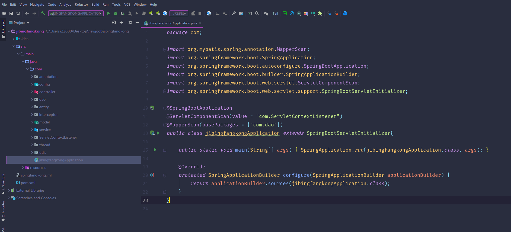

数据库表

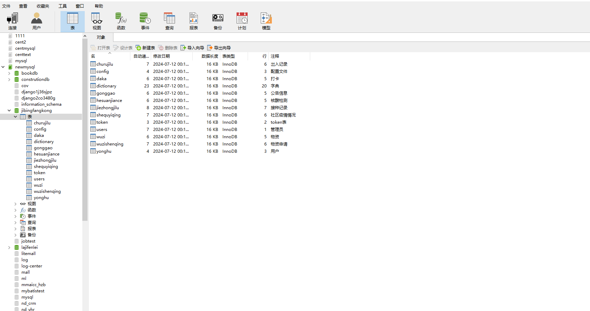

登录

前台页面首页

公告信息

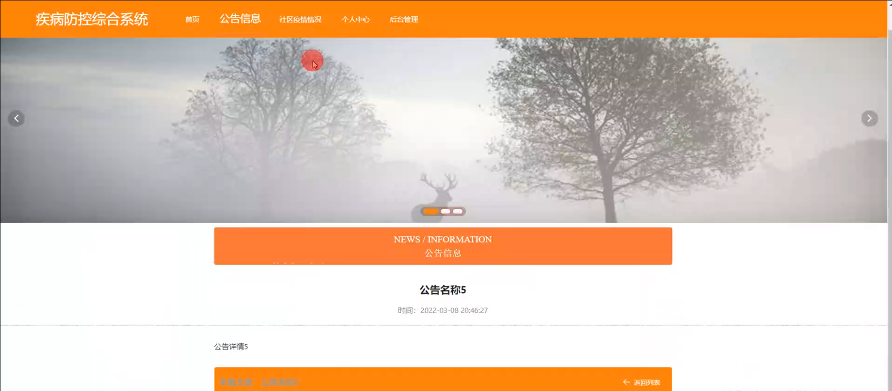

社区疫情情况

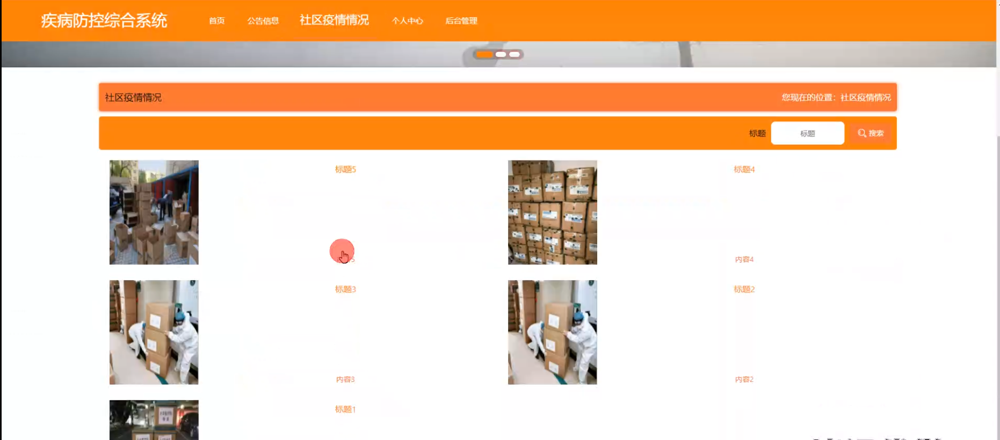

个人中心

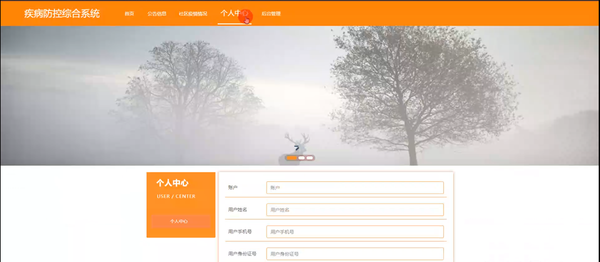

管理员端出入记录管理

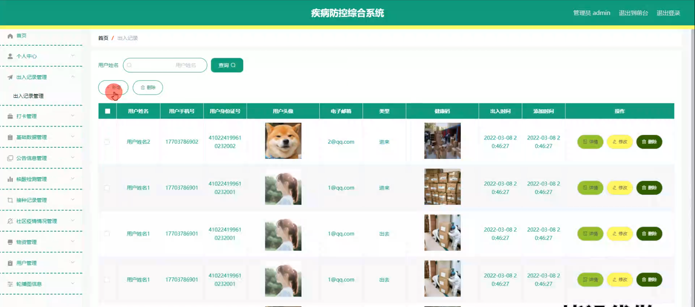

打卡管理

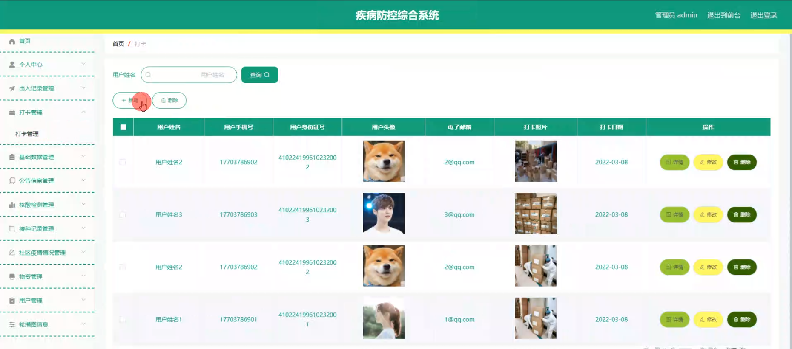

基础数据管理

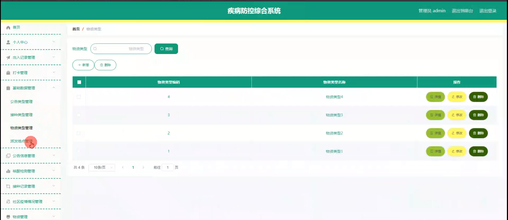

核酸检测管理

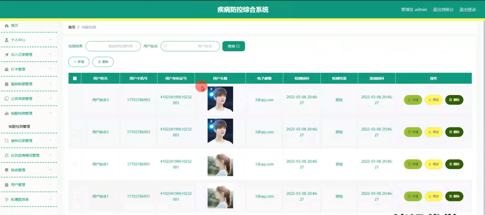

接种记录管理

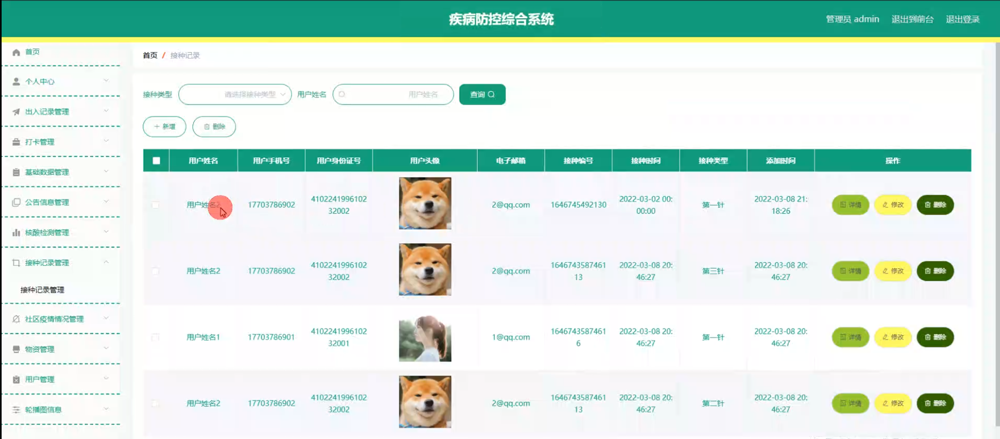

物资管理

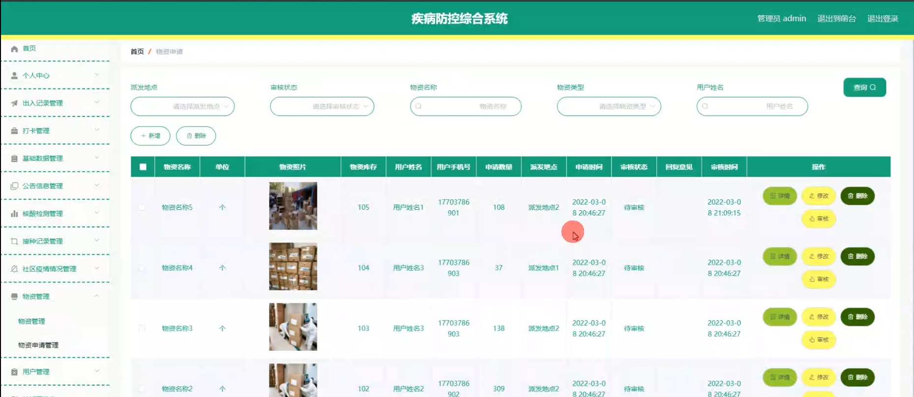

用户管理

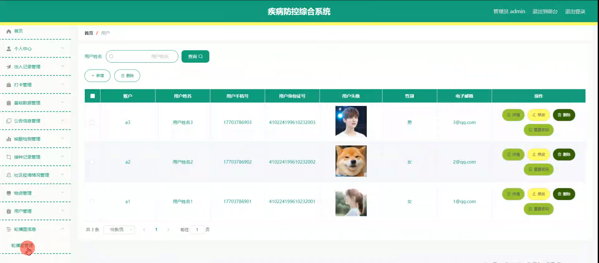

用户端后台管理

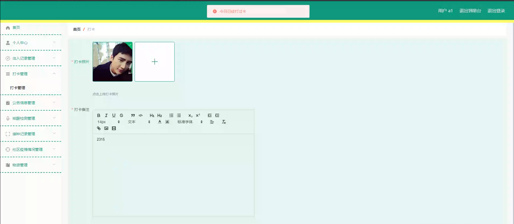

#### 总结

基于 Spring Boot 的疾病防控综合系统，通过明确管理员和用户的功能模块，实现了疾病防控工作的信息化、规范化和协同化。该系统在提升防控效率、保障公众健康、优化资源配置等方面发挥了重要作用，为应对疾病挑战提供了有力的技术支持。

#### 使用说明

创建数据库，执行数据库脚本 修改jdbc数据库连接参数 下载安装maven依赖jar 启动idea中的springboot项目

前台登录页面
http://localhost:8080/jibingfangkong/front/index.html

后台登录页面
http://localhost:8080/jibingfangkong/admin/dist/index.html

管理员			账户:admin 		密码：admin

用户				账户:a1 		密码：123456